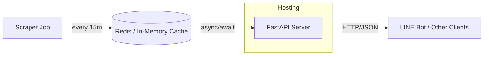

# 龍谷大学生協 青志館食堂メニューランキング API

> FastAPI ベースで *https://west2-univ.jp/sp/rank.php?t=650514* から取得したランキング情報を LINE Bot などに提供するサーバー実装の仕様書です。

---

## 目次
1. [概要](#概要)
2. [システム構成](#システム構成)
3. [API 仕様](#api-仕様)
4. [データモデル](#データモデル)
5. [環境変数](#環境変数)
6. [セットアップ](#セットアップ)
7. [起動方法](#起動方法)
8. [テスト](#テスト)
9. [デプロイ](#デプロイ)
10. [ライセンス](#ライセンス)

---

## 概要
- **目的**: 食堂メニューのリアルタイムランキングを外部アプリ（LINE 等）へ提供する JSON API を構築し、利用者が手軽に人気メニューを把握できるようにする。
- **言語 / フレームワーク**: Python 3.11 / FastAPI + Uvicorn (ASGI)
- **更新頻度**: 15 分毎（APScheduler で実行するバックグラウンドジョブ）
- **キャッシュ**: Redis もしくはメモリ内辞書 (開発用) にスクレイプ結果を保持

---

## システム構成


### コンポーネント
| コンポーネント | 役割 | 主なライブラリ |
|----------------|------|---------------|
| **Scraper Job** | 目標ページをクロールし HTML を解析 | `httpx`, `beautifulsoup4`, `lxml`, `apscheduler` |
| **FastAPI** | API エンドポイントを提供 | `fastapi`, `pydantic`, `uvicorn` |
| **Cache** | 取得データを保持し高速化 | `redis` / `aioredis` |

---

## API 仕様
> バージョンプレフィックスとして `/api/v1/` を採用 (将来の非互換変更に備える)

### エンドポイント一覧
| メソッド | パス | 概要 | クエリ/パラメータ | 認証 |
|----------|------|------|------------------|------|
| GET | `/api/v1/ranking` | ランキング一覧 | `top` (int, default 10) / `category` (enum all\|mecha\|osusume\|imaiipo) | ✅ (API‑Key) |
| GET | `/api/v1/menu/{menu_id}` | メニュー詳細 | ‑ | ✅ |
| GET | `/api/v1/line/flex` | Flex Message 用 JSON | `top` (int) | ✅ |
| GET | `/api/v1/last_update` | 最終更新時刻 | ‑ | 🔓 |
| GET | `/api/v1/healthz` | 死活監視 | ‑ | 🔓 |

### レスポンス例
<details>
<summary>`/api/v1/ranking?top=3`</summary>

```jsonc
{
  "updated_at": "2025-04-20T22:10:00+09:00",
  "items": [
    {
      "rank": 1,
      "id": 814817,
      "name_ja": "大学芋",
      "name_en": "Fried sweetpotato with sugar",
      "votes": { "mecha_oshi": 141, "osusume": 5, "imaiipo": 4 },
      "price_jpy": 121,
      "energy_kcal": 157
    },
    { "rank": 2, "id": 814900, "name_ja": "牛乳", ... }
  ]
}
```
</details>

#### エラーレスポンス
| HTTP | 説明 | body サンプル |
|------|------|--------------|
| 401 | API Key 不正 | `{ "detail": "Unauthorized" }` |
| 404 | リソース未存在 | `{ "detail": "Menu not found" }` |
| 429 | レート制限超過 | `{ "detail": "Rate limit exceeded" }` |
| 503 | データ未取得 | `{ "detail": "Data temporarily unavailable" }` |

---

## データモデル
### RankingItem
| フィールド | 型 | 説明 |
|------------|----|------|
| `rank` | int | 順位 (1‑based) |
| `id` | int | メニュー ID (`c` パラメータ) |
| `name_ja` | str | 日本語名 |
| `name_en` | str | 英語名 (任意) |
| `votes` | object | 投票数 (3 カテゴリ) |
| `price_jpy` | int | 価格 (円) |
| `energy_kcal` | int | エネルギー (kcal) |

### MenuDetail = RankingItem + 栄養素
`nutrition` サブオブジェクトに **たんぱく質 / 脂質 / 炭水化物 / 食塩相当量** を追加。

---

## 環境変数
| 変数 | 必須 | デフォルト | 説明 |
|------|------|-----------|------|
| `API_KEY` | ✅ | なし | クライアント認証キー |
| `SCRAPE_INTERVAL_MIN` | ❌ | 15 | スクレイプ間隔 (分) |
| `TARGET_URL` | ❌ | `https://west2-univ.jp/sp/rank.php?t=650514` | 取得先 URL |
| `REDIS_URL` | ❌ | `redis://localhost:6379/0` | Redis 接続先 |

---

## セットアップ
```bash
# 1. clone
$ git clone https://github.com/ryukoku-dx/ranking-api.git
$ cd ranking-api

# 2. Python env
$ pyenv install 3.11.7
$ pyenv local 3.11.7
$ python -m venv .venv
$ source .venv/bin/activate

# 3. Install deps
$ pip install -r requirements.txt

# 4. Redis (ローカル)
$ docker run -d --name redis -p 6379:6379 redis:7-alpine

# 5. .env 作成
API_KEY="supersecret"
```

---

## 起動方法
```bash
$ uvicorn app.main:app --reload --port 8000
```
アクセス: http://localhost:8000/docs で Swagger UI を確認。

バックグラウンドジョブと ASGI は同一プロセスで動きます。

---

## テスト
```bash
# pytest + httpx + respx でモック
$ pytest -q
```
CI には GitHub Actions を使用。

---

## デプロイ
### Docker
```dockerfile
FROM python:3.11-slim
WORKDIR /app
COPY requirements.txt .
RUN pip install --no-cache-dir -r requirements.txt
COPY . .
CMD ["uvicorn", "app.main:app", "--host", "0.0.0.0", "--port", "80"]
```

```bash
$ docker build -t ranking-api:latest .
$ docker run -d -p 80:80 --env-file .env ranking-api:latest
```

### Cloud Run / Railway など
- ポート環境変数 `PORT` を読んで `uvicorn` 実行
- Redis はマネージドサービスを利用し `REDIS_URL` で指定

---

## ライセンス
MIT License （予定）

---

> **Maintainer**: Ryukoku Digital X Team (RDX Team)  
> ご質問・改善提案は Issues へお気軽にどうぞ。

